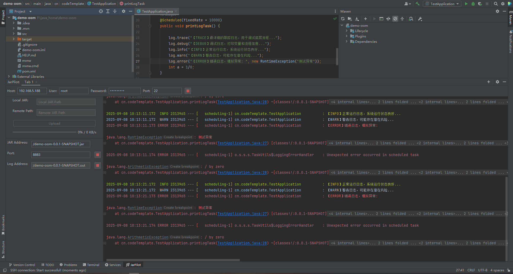

# JarPilot

---

🚀 **JarPilot** 是一个用于 **远程管理 Spring Boot JAR 服务** 的 IntelliJ IDEA 插件。  
它可以帮助你快速上传 JAR 文件到服务器，启动/停止服务，并在 IDE 中实时查看日志，就像在控制台一样。

---

## ✨ 功能特性

- 📤 **一键上传 JAR 文件** 到远程服务器
- 🟢 **启动服务**：支持基于 PID 文件和端口检测的安全启动
- 🔴 **停止服务**：支持 PID 文件与端口方式停止
- 📜 **实时日志浏览**：与 IDEA 控制台一致的高亮日志流显示
- 🎨 **日志高亮**：自动区分 `INFO` / `WARN` / `ERROR` / `DEBUG` 级别，并支持异常堆栈渲染
- ⚙️ **持久化配置**：保存服务器连接和服务参数，重启 IDE 后依然可用

---

---

## 📦 安装

直接在 **JetBrains Marketplace** 搜索 **JarPilot** 并安装。

路径：  
`Settings → Plugins → Marketplace → 搜索 "JarPilot" → Install`

---

